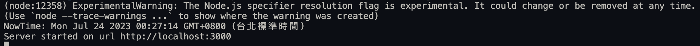
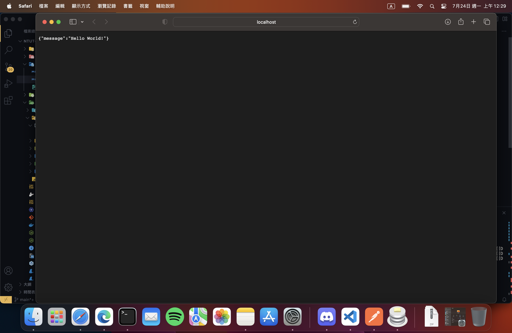

## 操作說明

1. 首先, 請確認電腦環境已安裝nodejs, npm。
2. 接著, 請下載此專案, 並且在專案目錄下執行`npm install`。
3. 再來, 請執行`npm run start`。
4. 至此您將換看到命令行顯示 `Server started on url http://localhost:3000`

5. 最後, 請開啟瀏覽器, 輸入網址`http://localhost:3000`即可看到網頁。

